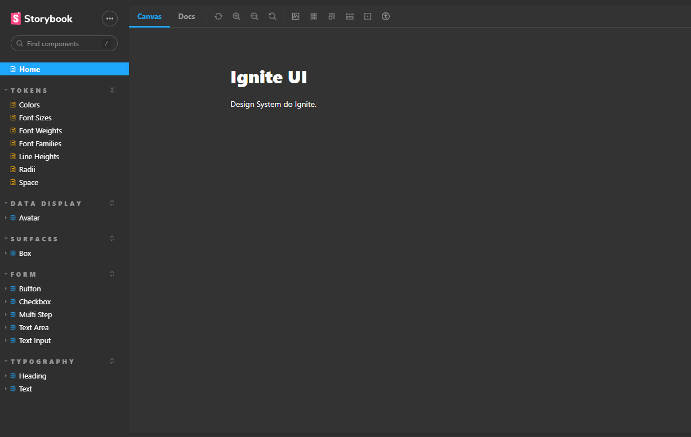

<p align="center">
  
</p>


<br/>


## **💻** Projeto

Um sistema inteiro de agendamento da sua forma… quem nunca imaginou isso? E se todos os elementos da tela (botão, cores, textos, títulos) fossem todos personalizados à suas necessidades? A fim de consolidar ainda mais meus conhecimentos sendo alinhado com as novas e melhores práticas e tecnologias disponíveis no mundo da tecnologia, desenvolvi uma aplicação realizada durante o programa de aceleração “Ignite - ReactJS”, promovido pela Rocketseat, onde contruímos um Monorepo de sistema de padronização de cores, elementos - conhecido como “Design System” - para este tipo de aplicação.   

<br/>

 
<p align="center">
  
</p>

## Tecnologias utilizadas

- [Typescript](https://www.typescriptlang.org/)
- [ReactJS](https://pt-br.reactjs.org/)
- [tsup](https://github.com/egoist/tsup)
- [Storybook](https://storybook.js.org/)
- [Stitches](https://stitches.dev/)
- [Eslint](https://eslint.org/)
- [TurboRepo](https://turbo.build/)
- [Changesets](https://github.com/changesets/changesets/)
- [phosphor-react](https://phosphoricons.com/)
- [polished](https://polished.js.org/)
- [vite](https://vitejs.dev/)

## **🔖 Deploy**

Você pode visualizar a documentação e os elementos através dos links abaixo:

- [Documentação](https://srsouzaj.github.io/05-designSystem/)
- [Figma Layout](https://www.figma.com/community/file/1161274296921389678)

<br/>

## **🚀** Como Executar

```bash
## Clone o projeto em sua máquina
git clone [https://github.com/srsouzaj/05-designSystem.git](https://github.com/srsouzaj/05-designSystem.git)

# Acessar o projeto no terminal
$ cd 05-designSystem

# Instalar as dependências
$ npm install

# Executar o servidor em modo de desenvolvimento
$ npm run dev
```

## 📝 License

Esse projeto está sob a licença MIT. Veja o arquivo [LICENSE](https://github.com/srsouzaj/05-designSystem/blob/master/LICENSE.md) para mais detalhes.

Feito com ❤️ por Jorge de Souza
